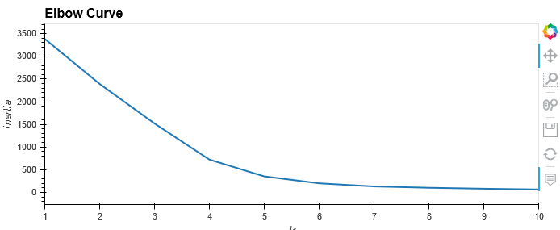
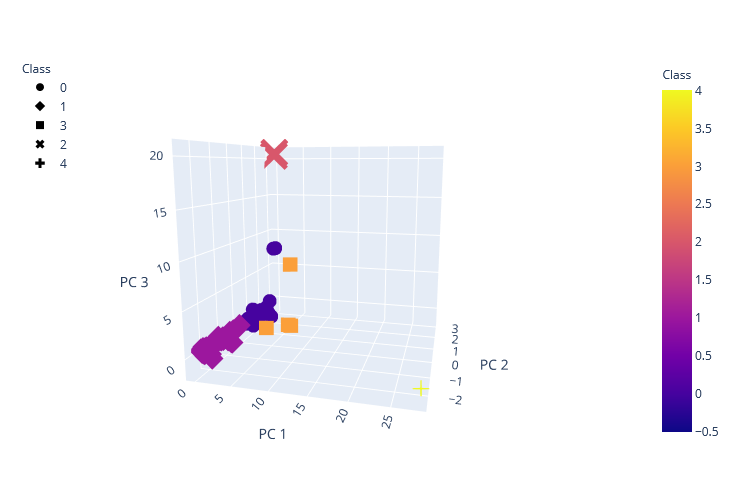
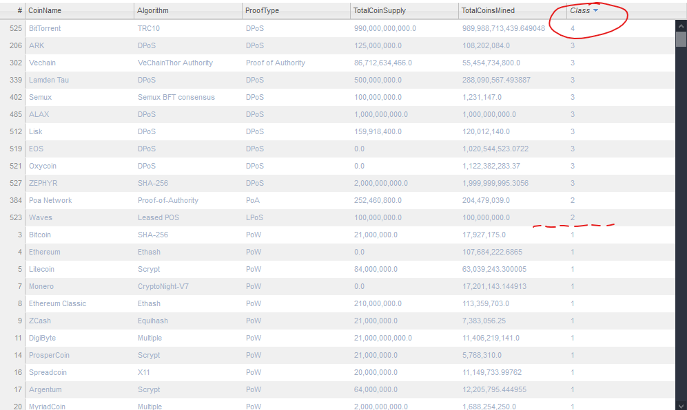
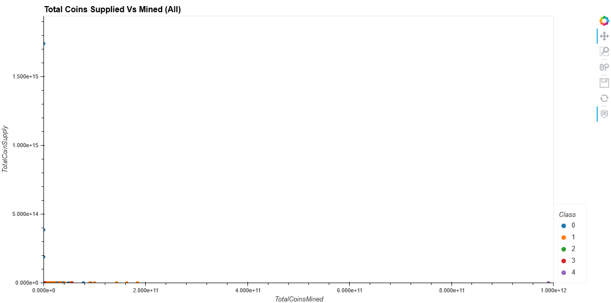
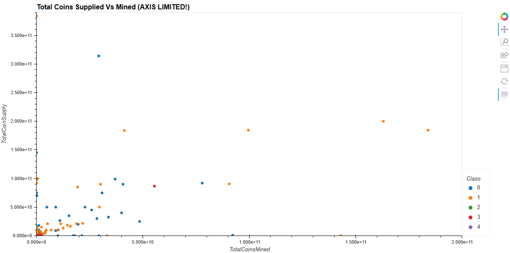

# Cryptocurrencies Analysis using Unsupervised Machine Learning
In this repo I demonstrate techniques of Unsupervised Machine Learning to perform analysis of cryptocurrencies for a mock business proposal.  

In a mock scenario where an investment bank wishes to offer new cryptocurrencies for its customers and we are tasked to present a report of how the cryptocurrencies are trading on the market and how cryptocurrencies could be grouped toward creating classification for developing a new investment product.  

Since we have no known output, unsupervised machine learning is suited for the task.  We will be able to group cryptocurrencies and provide data visualizations to share our findings.  

## Journey of Data Analysis  (High level Jupter cells explanation) 
* Load libraries and dependencies
* Load raw CSV file
* Identify data types
* Prep and transform data column from object to float
* Clean data
  * Remove non active cryptocurrencies
  * Remove cryptocurrencies that doesn't have an algorithm
  * Remove Trading status column
  * Remove any incomplete Data cryptocurrencies
  * Remove any cryptocurrencies that hasn't been mined
* Extract Coin Name out and hold separately
* Use get_dummies method to distinguish algorithms into own feature
* Scale data for proper weight
* Use Principle Component Analysis (PCA) to thin down meaningful components
* Use elbow curve to best K value for K-means method
* Apply K-means model and obtain our classification
* Examine the data by 3d and 2d graphs, tables.  

## Analysis & Report
By using unsupervised machine learning, we can categorize active cryptocurrencies in 5 groups on the market.  Using elbow method, it allowed us to identify clusters with diminishing return.  
 
By using a 3d scatter plot we visualized the classifictions of the cryptocurrencies.  

Putting our data together in a table.  By sorting on Class column we get a sense of cluster sizes. Majority of the cryptocurrencies are in Class 0 and 1, with only BitTorrent in Class 4.  

If we plot on 2d scatter, we can see there are some extreme outliers if compared for TotalCoinSupply vs TotalCoinsMined.

If we limit our axis and avoid the extreme outliers, we have the final plot.

## Conclusion
Through our journey, we demonstrated cryptocurrencies can be clustered by using unsupervised machine learning.  While there are differences between all cryptocurrencies, there are definitive categorizations by our finding.  We not only have found clustering patterns, but also identified outliers.  Our finding is useful to help a business venture to further explore the world of cryptocurrencies. 
